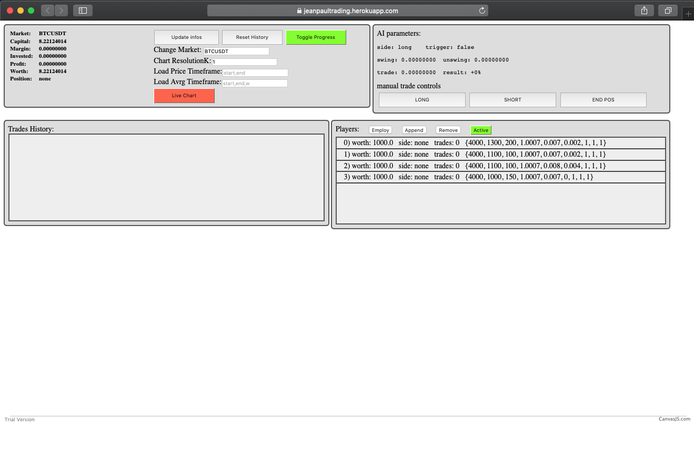

## jeanpaultrading
my *extremely* rudimentary bitcoin trading bot architecture.

This project was basically a way for me to experiment with different full-stack development challenges. Namely designing a not so simple server environment, that asynchronously fetches data from multiple APIs, keeps track of historical data using a remote database and manages clients; as well as an interactive website to interface with such server.

Features:
- keeping track of multiple cryptocurrencies price timewindow on a remote database, to have always at hand data to work with to make intelligent inferences (on the scales of an instance every second, for a week into the past), as well as computing common trading price metrics on this historical data (like volatility, moving averages)
- keeping track of the Binance account's wallet information
- ability to implement multiple intelligent systems, referred to as "Players" or "Strategies", that infer when to open or close a trading position based on the above mentioned data (more on this below)
- keeping track of the Players performance by observing how much their worth would change over time if they could trade on the Binance Exchange, to make a better informed decision on which trading strategy to employ
- based on trigger events from the employed Player the server uses the Binance API to open and close trading positions on the Binance Exchange platform (specifically I chose Futures trading, so leveraged Long and Short positions)
- email feedback regarding current wallet information and trading strategy key events, as well as debug information about the server and different clients currently active
- server hosted freely on Heroku.com, with hassle free restart (by saving all current settings, historical price data and the players' historical stats on the remote Firebase database)

About the actual trading strategies: Since my focus lied primarily with the development aspect of the project, to get started I just used the most simple and notoriously ineffective *Intersecting moving averages* approach, since I just needed a placeholder method to implement in my project. Developing a winning trading strategy is a whole science by itself, that I didn't feel like delving into, but the point is that such a strategy could be implemented in my architecture to do all the above mentioned things.

Here is e preview of the interactive website.
Now it seems a bit empty because some things have changed in the Binance API since I have finished the project (more than a year ago), and now many account authentication errors are thrown, which means the communication with the API is disabled on the server at startup. But the server itself seems to work.

